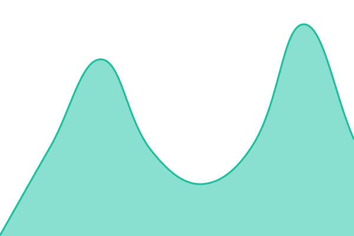

# [📈 Live Status](https://status.bechard-studio.com): <!--live status--> **🟩 All systems operational**

This repository contains the open-source uptime monitor and status page for [Emiliano Bechard](https://bechard-studio.com), powered by [Upptime](https://github.com/upptime/upptime).

With [Upptime](https://upptime.js.org), you can get your own unlimited and free uptime monitor and status page, powered entirely by a GitHub repository. We use [Issues](https://github.com/EmilianoBechard/status-page/issues) as incident reports, [Actions](https://github.com/EmilianoBechard/status-page/actions) as uptime monitors, and [Pages](https://status.bechard-studio.com) for the status page.

<!--start: status pages-->
<!-- This summary is generated by Upptime (https://github.com/upptime/upptime) -->
<!-- Do not edit this manually, your changes will be overwritten -->
<!-- prettier-ignore -->
| URL | Status | History | Response Time | Uptime |
| --- | ------ | ------- | ------------- | ------ |
|  [Bechard Studio Web](https://bechard-studio.com) | 🟩 Up | [bechard-studio-web.yml](https://github.com/EmilianoBechard/status-page/commits/HEAD/history/bechard-studio-web.yml) | 

 153ms
     
 | 

<a href="https://status.bechard-studio.com/history/bechard-studio-web">100.00%</a>
    

|  [n8n Automation](https://n8n.bechard-studio.com) | 🟩 Up | [n8n-automation.yml](https://github.com/EmilianoBechard/status-page/commits/HEAD/history/n8n-automation.yml) | 

 433ms
     
 | 

<a href="https://status.bechard-studio.com/history/n8n-automation">65.70%</a>
    

|  [G52 Monitor](https://monitor.bechard-studio.com) | 🟩 Up | [g52-monitor.yml](https://github.com/EmilianoBechard/status-page/commits/HEAD/history/g52-monitor.yml) | 

 426ms
     
 | 

<a href="https://status.bechard-studio.com/history/g52-monitor">66.68%</a>
    

|  [Bechard CRM](https://crm.bechard-studio.com) | 🟩 Up | [bechard-crm.yml](https://github.com/EmilianoBechard/status-page/commits/HEAD/history/bechard-crm.yml) | 

 241ms
     
 | 

<a href="https://status.bechard-studio.com/history/bechard-crm">100.00%</a>
    

<!--end: status pages-->

[**Visit our status website →**](https://status.bechard-studio.com)

## 📄 License

- Powered by: [Upptime](https://github.com/upptime/upptime)
- Code: [MIT](./LICENSE) © [Anand Chowdhary](https://anandchowdhary.com), supported by [Pabio](https://pabio.com)
- Data in the `./history` directory: [Open Database License](https://opendatacommons.org/licenses/odbl/1-0/)
